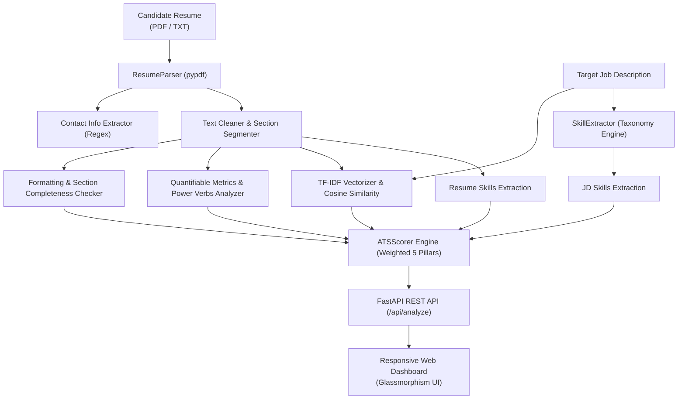

# 📄 AI Resume Analyzer & ATS Optimization Engine

[](https://www.python.org/)
[](https://fastapi.tiangolo.com/)
[](https://scikit-learn.org/)
[]()
[]()

An intelligent, privacy-first resume parsing and Applicant Tracking System (ATS) evaluation engine. Built with **FastAPI**, **Scikit-Learn TF-IDF**, regex heuristics, and a glassmorphism web dashboard. Designed to evaluate candidate resumes against target job descriptions, calculate multi-dimensional compatibility scores, detect skill gaps, and provide actionable optimization checklists.

---

## 🌟 Key Features

- **Multi-Format Parsing**: Extracts structured text, contact metadata (email, phone, LinkedIn, GitHub), and section boundaries from PDF and plain-text files using `pypdf`.
- **Curated 500+ Skill Taxonomy**: Multi-category skill extraction covering Languages, AI/ML/Data, Web Frameworks, Databases, DevOps, and Core CS Fundamentals with phrase disambiguation and alias resolution (e.g. *sklearn* → *Scikit-Learn*, *k8s* → *Kubernetes*).
- **Multi-Dimensional ATS Scoring (5 Pillars)**:
  1. **Hard Skills & Taxonomy Match (40%)**: Compares extracted candidate skills against target job requirements.
  2. **Semantic & TF-IDF Similarity (25%)**: Computes cosine similarity across unigram and bigram TF-IDF vectors for deep contextual alignment.
  3. **Section Completeness (15%)**: Validates standard ATS headers (Education, Experience, Skills, Projects, Contact Info).
  4. **Quantifiable Impact & Power Verbs (10%)**: Analyzes metric usage (%, latency, quantities) and active engineering verbs.
  5. **Formatting & Length Hygiene (10%)**: Enforces word count sweet-spots and flags missing contact links.
- **Actionable Optimization Checklist**: Categorizes recommendations into High, Medium, and Low priorities for instant resume revision.
- **Built-in Presets & Sample Resume**: Includes one-click test presets for *AI/ML Engineering Intern*, *Full-Stack Developer*, and *Data Scientist*.
- **Report Export**: Browser-optimized clean print stylesheet for saving professional PDF audit reports.

---

## 🏗️ Architecture & Pipeline



---

## 🛠️ Tech Stack

| Domain | Technologies |
|---|---|
| **Backend & REST API** | Python 3.10+, FastAPI, Uvicorn, Pydantic |
| **Machine Learning & NLP** | Scikit-Learn (`TfidfVectorizer`, `cosine_similarity`), NumPy |
| **Document Processing** | `pypdf`, ReportLab (PDF sample generation) |
| **Frontend & UI** | HTML5, Modern CSS3 (Glassmorphism, CSS Variables), Vanilla JavaScript ES6+ |
| **Testing & Quality** | Python `unittest`, FastAPI `TestClient` |

---

## 📁 Repository Structure

```text
ai-resume-analyzer/
├── backend/
│   ├── __init__.py
│   ├── main.py              # FastAPI REST endpoints & static file serving
│   ├── parser.py            # PDF extraction, contact regex & section segmentation
│   ├── skill_extractor.py   # Multi-category skill taxonomy & alias mapping
│   ├── ats_scorer.py        # 5-pillar mathematical ATS scoring algorithm
│   └── requirements.txt     # Python production dependencies
├── frontend/
│   ├── index.html           # Modern glassmorphism dashboard layout
│   ├── styles.css           # Custom dark styling, responsive grid & print rules
│   └── app.js               # Client controller, drag-drop & dynamic rendering
├── sample_data/
│   ├── sample_resumes/      # Realistic student sample resumes (.pdf and .txt)
│   └── sample_jobs/         # Industry job descriptions across AI, Web, Data
├── tests/
│   └── test_analyzer.py     # Automated unit & integration test suite (10 tests)
├── .gitignore
├── run.py                   # One-click application entrypoint
├── INTERVIEW_PREP.md        # Technical interview defense & algorithmic Q&A
└── README.md
```

---

## 🚀 Getting Started

### 1. Prerequisites
Ensure **Python 3.10+** and **Git** are installed on your machine.

### 2. Installation
Clone the repository and install dependencies:

```bash
git clone https://github.com/pranayprom2008-cyber/ai-resume-analyzer.git
cd ai-resume-analyzer
python -m pip install -r backend/requirements.txt
```

### 3. Running the Application
Start the server using the entrypoint script:

```bash
python run.py
```

Open your browser and navigate to:
- **Web Application**: [http://127.0.0.1:8000](http://127.0.0.1:8000)
- **Interactive Swagger API Docs**: [http://127.0.0.1:8000/docs](http://127.0.0.1:8000/docs)

---

## 🧪 Running Automated Tests

Run the full suite of automated unit and endpoint tests:

```bash
python -m unittest discover -s tests -p "test_*.py"
```

All 10 tests should pass with `OK`.

---

## 📡 API Endpoints

### `POST /api/analyze`
Accepts a multipart form with a resume (file or text) and a target job description.

**Parameters:**
- `job_description` *(string, required)*: Target job requirements text.
- `resume_file` *(file, optional)*: PDF or TXT file upload.
- `resume_text` *(string, optional)*: Direct raw text input.

**Sample Request (cURL):**
```bash
curl -X POST "http://127.0.0.1:8000/api/analyze" \
  -F "job_description=Seeking an AI/ML Engineer skilled in Python, PyTorch, Scikit-Learn, and FastAPI." \
  -F "resume_file=@sample_data/sample_resumes/sample_aiml_resume.pdf"
```

**Sample JSON Response:**
```json
{
  "overall_score": 78.4,
  "verdict": "Excellent Match",
  "component_scores": {
    "skill_match": 85.0,
    "semantic_similarity": 74.2,
    "section_completeness": 100.0,
    "impact_and_metrics": 80.0,
    "formatting_and_length": 90.0
  },
  "skills": {
    "matched": ["FastAPI", "OpenCV", "PyTorch", "Python", "Scikit-Learn"],
    "missing": ["TensorFlow"],
    "additional": ["C++", "Docker", "PostgreSQL"]
  },
  "recommendations": [
    {
      "priority": "HIGH",
      "category": "Skills Gap",
      "message": "Incorporate target skills from the job posting: TensorFlow."
    }
  ]
}
```

---

## 🔮 Future Enhancements

- [ ] Multi-lingual resume parsing with cross-language embeddings.
- [ ] Integration with local LLMs (via Ollama / HuggingFace) for generative bullet point rewriting.
- [ ] Direct export to ATS-optimized Word (.docx) format.
- [ ] LinkedIn profile PDF parser integration.

---

## 👤 Author

**M Pranay**  
- GitHub: [@pranayprom2008-cyber](https://github.com/pranayprom2008-cyber)  
- Portfolio: [mpranay.com](https://github.com/pranayprom2008-cyber)
